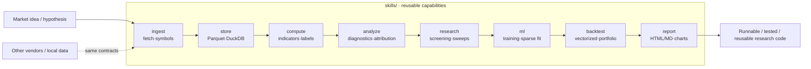

<h1 align="center">QuantSpace</h1>

<p align="center"><a href="README.md">简体中文</a> | <b>English</b></p>

<p align="center">An AI-native quantitative research framework: describe your idea in the project directory, and an AI agent builds it into runnable, tested, reusable strategy-research code along fixed engineering boundaries.</p>

<p align="center">
  
  
  
  
  
</p>

QuantSpace is an AI-native quantitative research framework for turning a market
idea into working strategy research without leaving the project directory.
Describe a hypothesis, universe, factor, label, rule, model, backtest constraint,
or report you want; an AI coding agent can then build on the repository's
structure to produce runnable, tested, reviewable code. The project is
compatible with mainstream AI coding tools including Codex, Claude Code, and
Cursor.

PandaData is the default market data provider, so real bars can be used
immediately. Data flows in through `skills.ingest`, where external symbols and
raw frames are normalized into QuantSpace conventions. Other vendors and local
datasets can plug into the same contracts, allowing the rest of the workflow to
stay unchanged.

The framework packages the full research loop as reusable skills: data
ingestion, local Parquet storage with optional DuckDB queries, factor
calculation and analysis, rule-based and machine-learning strategy development,
portfolio construction, vectorized backtesting, and performance report
management. Portfolio construction and execution now share the `backtest` skill;
model training and sparse fitting live under `ml`. `AGENTS.md` and the
per-skill `SKILL.md` files teach AI agents how to reuse these modules instead of
scattering research logic across one-off scripts.

## Architecture Overview

External bars are normalized through `ingest` into the local `store`, then reused
on demand by the capability modules, and finally distilled into reports and
reusable strategy code. The AI orchestrates the whole loop along fixed data
contracts:



## Project Layout

The repository layout is part of the product: it gives both humans and AI agents
clear places to put data access, reusable capabilities, strategy logic, scripts,
reports, and tests.

```text
quantspace/
  skills/                 reusable capabilities
    ingest/               data ingestion: default PandaData client and symbol conversion
    store/                local Parquet storage, DuckDB queries, artifact management
    compute/              indicators, labels, utilities, factor examples
    analyze/              factor analysis, metrics, attribution, tearsheets
    backtest/             vectorized execution, weighting, filters, costs
    ml/                   ML helpers and optional model engines
    research/             factor screening, parameter sweeps, comparisons
    report/               HTML/Markdown report rendering and charts
  strategies/
    cross_sectional/      cross-sectional strategy
    time_series/          time-series strategy
  scripts/                sample data, demos, PandaData import helper
  data/                   local data root; only sample pools are committed
  reports/                local generated report output
  docs/                   minimal supplemental notes, including PandaData ingest
  tests/                  public pytest suite
```

## Public Skills

Skills are the reusable building blocks that an AI agent should reach for before
writing new research code.

| Skill | Main import | Purpose |
|---|---|---|
| `ingest` | `from skills.ingest import PandaDataClient` | Data ingestion, default PandaData access, symbol conversion |
| `store` | `from skills.store.data_manager import DataManager` | Market data, pools, factors, backtests, metadata |
| `compute` | `from skills.compute.indicators import trend_score` | Indicators, labels, utilities, generic factor examples |
| `analyze` | `from skills.analyze.factor_analysis import IC_stat` | Factor diagnostics, attribution, robustness, time-series checks |
| `backtest` | `from skills.backtest import VectorBacktester` | Vectorized execution, portfolio weighting, filters, costs, strategy blending, exit and overlay metrics |
| `ml` | `from skills.ml.ml_engine import MLEngine` | ML training/inference helpers, ML factors, and sparse LASSO fitting |
| `research` | `from skills.research import screen_all_indicators` | Factor screening and parameter sweeps |
| `report` | `from skills.report import ReportRenderer` | HTML/Markdown report rendering and chart helpers |

Each skill directory contains a `SKILL.md` guide. There is no separate public
`construct` or `model` skill: portfolio construction belongs in `backtest`, and
model-related helpers belong in `ml`.

## Quick Start

Requirements:

- Python `>=3.10`
- `uv`

Install the default environment, generate a small deterministic fixture dataset,
and run the demos:

```bash
cp .env.example .env # set PANDA_DATA_USERNAME and PANDA_DATA_PASSWORD
uv sync
uv run python scripts/generate_sample_data.py
uv run python scripts/run_cross_sectional_demo.py
uv run python scripts/run_time_series_demo.py
uv run python -m pytest tests/
```

The fixture data is synthetic and deterministic, so the demos are reproducible
and safe to rerun. It is written under `data/market/`; for real research, replace
it with daily Parquet files from PandaData or another adapter that follows the
same data model.

Optional extras:

```bash
uv sync --extra panda_data  # PandaData SDK
uv sync --extra ml          # optional PyCaret-based ML helpers
uv sync --extra query       # optional DuckDB querying
```

## PandaData Setup

PandaData is optional at install time and becomes active once the SDK and
credentials are available:

```bash
uv sync --extra panda_data
cp .env.example .env
```

Set credentials in `.env`. `PandaDataClient` only reads `PANDA_DATA_*`
credential names:

```bash
PANDA_DATA_USERNAME=86xxxxxxxxxxx
PANDA_DATA_PASSWORD=your-password
```

Then try a small import:

```bash
uv run python scripts/import_panda_data_demo.py \
  --symbol SHSE.600000 \
  --start-date 20230101 \
  --end-date 20231231
```

QuantSpace uses `EXCHANGE.CODE` symbols, such as `SHSE.510300`. PandaData-style
symbols are converted through:

```python
from skills.ingest import to_panda_data_symbol, to_quantspace_symbol

to_panda_data_symbol("SHSE.510300")  # "510300.SH"
to_quantspace_symbol("510300.SH")    # "SHSE.510300"
```

## Data Model

The data model stays intentionally simple so generated strategy code can depend
on it. Market data is stored as one Parquet file per symbol:

```text
data/market/{frequency}/{symbol}.parquet
```

Each OHLCV frame is indexed by `eob` and uses:

```text
open, high, low, close, volume
```

Pools are JSON files under `data/pools/`:

```json
{
  "pool_id": "sample_etf_rotation",
  "description": "ETF-style pool for public examples",
  "frequency": "1d",
  "symbols": ["SHSE.510300", "SHSE.510500"]
}
```

`DataManager.load_pool_data(pool_id)` returns a panel indexed by
`(symbol, eob)`.

Set `QUANTSPACE_DATA_ROOT` when you want the same code to use a data directory
outside the repository.

## Strategy Demos

The demos show the intended shape of strategy work: scripts orchestrate, skills
provide shared machinery, and `strategies/` holds domain logic.

### Cross-Sectional Rotation

Pipeline:

```text
panel OHLCV -> generic factors -> top-percent selection -> execution -> metrics
```

Run:

```bash
uv run python scripts/run_cross_sectional_demo.py
```

This demo combines simple momentum and low-volatility factors through
`strategies.cross_sectional.ModularBacktester`, using existing
`data/market/1d/` Parquet files for the configured sample pool.

### Time-Series ML

Pipeline:

```text
raw OHLCV bars -> feature engineering -> triple-barrier labels -> model -> backtest
```

Run:

```bash
uv run python scripts/run_time_series_demo.py
```

This demo uses `strategies.time_series.features.make_price_volume_features`,
`TripleBarrierLabelMaker`, a small scikit-learn classifier, a date x symbol
weight matrix, and `skills.backtest.VectorBacktester` on an existing
single-symbol daily Parquet file.

### Example Strategy Reports

```bash
uv run python scripts/run_strategy_reports.py
```

This thin orchestration script reads existing PandaData daily Parquet files from
`data/market/1d/` and writes four public strategy reports plus performance PNGs
to `reports/strategy_examples/`. Each strategy family has one rule-based example
and one XGBoost example. Strategy logic lives under `strategies/`; storage,
vectorized execution, portfolio weighting, ML helpers, and report rendering live
under `skills/`.

Below are the four public example performance charts produced by the script
(backtested on real historical data, **for demonstration only — not indicative of
future returns and not investment advice**):

<table>
<tr>
<td width="50%" align="center">
<br>
<sub><b>CSI 300 IF · MA10 ATR Reversion</b><br/>Rule / time-series · sample 2024 +22.1% · 2025 +36.3%</sub>
</td>
<td width="50%" align="center">
<br>
<sub><b>CSI 300 IF · XGBoost Triple-Barrier</b><br/>ML / time-series · sample 2024 +12.9% · 2025 +4.9%</sub>
</td>
</tr>
<tr>
<td width="50%" align="center">
<br>
<sub><b>Futures Cross-Sectional Reversal</b><br/>Rule / cross-sectional · sample 2024 +30.8% · 2025 +31.4%</sub>
</td>
<td width="50%" align="center">
<br>
<sub><b>Futures XGBoost Rank</b><br/>ML / cross-sectional · sample 2024 +18.7% · 2025 +45.7%</sub>
</td>
</tr>
</table>

> The sample returns above come from the public example reports under
> `reports/strategy_examples/`, are backtested on historical data, depend on the
> data window, parameters, and sample range, and **are not a return promise or
> investment advice**. See each `*.md` report for full metrics.

## Documentation

Use these notes when you need the details behind the README:

- [PandaData ingest](docs/panda_data_ingest.md)

## Development

Run the public test suite before handing work back:

```bash
uv run python -m pytest tests/
```

Before publishing, also run a release safety scan for private paths,
credentials, private strategy names, and removed research-only modules.
Generated data and private research reports should stay local; the sanitized
public examples under `reports/strategy_examples/` are the intended report
artifacts in the open repository.

## Data Sources and Assumptions

- The default data source is PandaData; other vendors or local datasets can be
  used as long as they follow the same data contracts.
- The bundled fixture data is synthetic OHLCV, used only for demos and
  reproducible tests, and does not represent real market data.
- The framework ships no profit-validated strategies; everything under
  `strategies/` and `reports/strategy_examples/` is illustrative.

## Limitations and Risk Boundaries

- QuantSpace is a research and engineering framework, not an automated trading
  system; it connects to no broker and places no orders.
- Factor, strategy, backtest, and report outputs are research materials only,
  constrained by the data window, parameter choices, and sample range.
- Whether to use any output in real trading must be decided independently by the
  user, together with their own strategy, risk controls, and execution process.

## Disclaimer

This repository is only a packaging of quantitative research methodology and an
engineering framework. It validates no return claims and does not constitute
investment advice. Do not use the framework or its example outputs directly as a
basis for investment decisions.

## Maintainer

Created or maintained by `abgyjaguo`.

## License

This project is licensed under the GNU General Public License v3.0. See [LICENSE](LICENSE).
