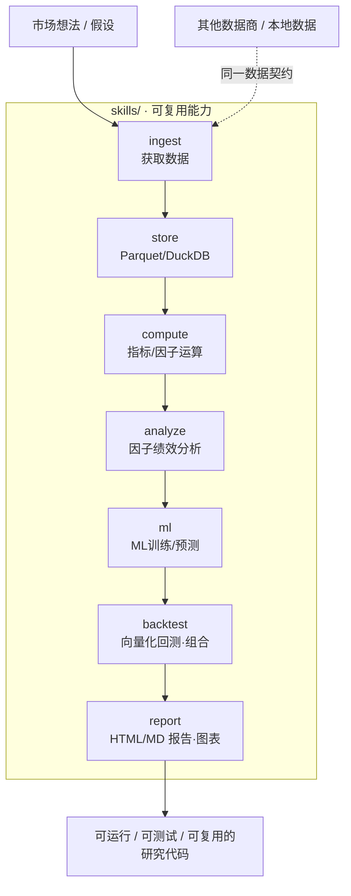
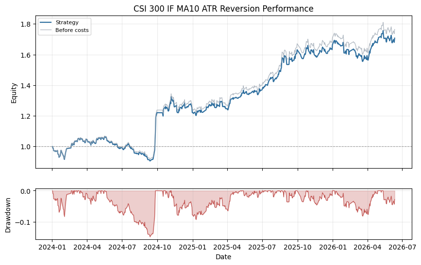
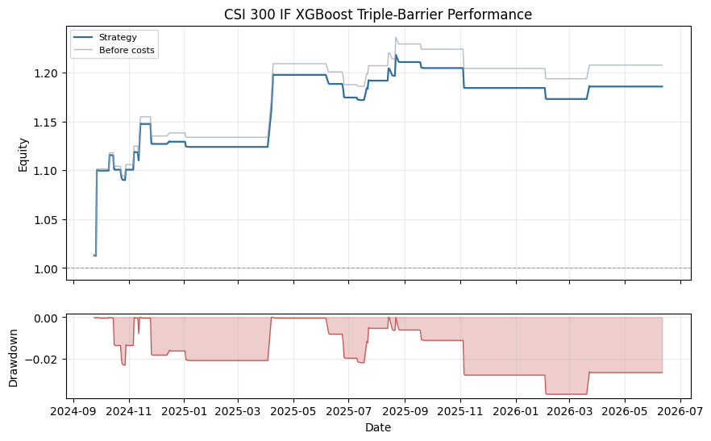
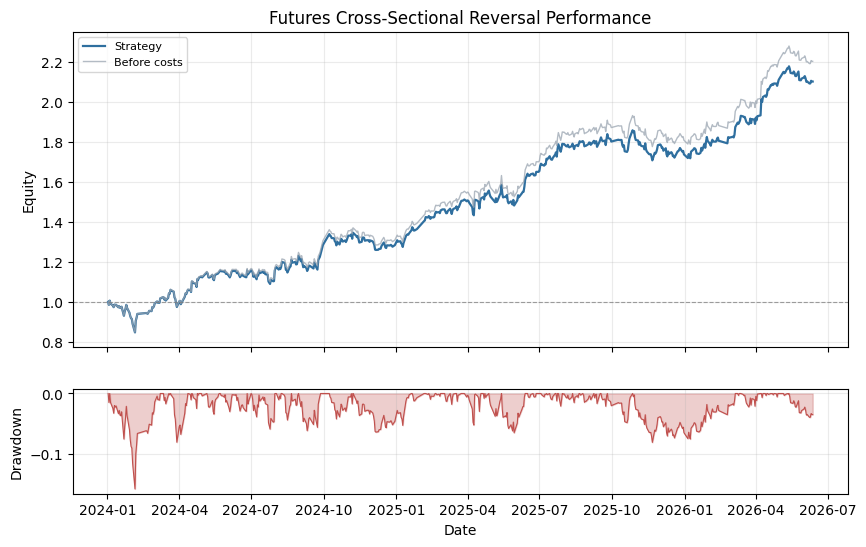
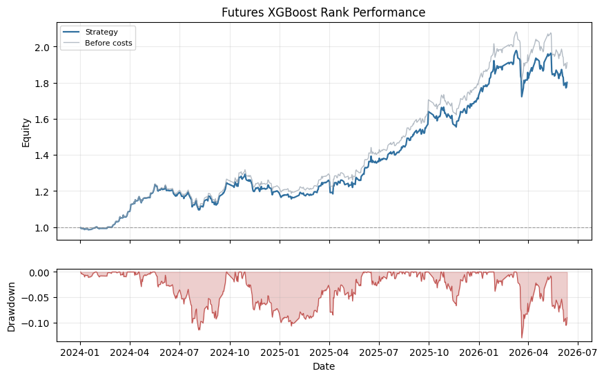

<h1 align="center">QuantSpace</h1>

<p align="center"><b>简体中文</b> | <a href="README.en.md">English</a></p>

<p align="center">面向 AI 时代重新设计的量化投研框架：在项目目录里说清想法，AI 沿着既定工程边界把它落成可运行、可测试、可复用的策略研究代码。</p>

<p align="center">
  
  
  
  
  
</p>

QuantSpace 是面向 AI 时代重新设计的量化投研框架。使用任意 AI coding工具打开本项目目录，直接告诉
AI 想要下载的数据、验证的市场假设、因子灵感、机器学习 label、交易策略、回测约束或报告要求；AI 会沿着既定工程边界，把想法落成可运行、可测试、可复用的策略研究代码。
该项目兼容 Chatgpt Codex, Claude Code, Cursor, CodeBuddy, Qoder, TRAE, OpenCode 等主流 AI 编程工具。

真实行情通过默认的 PandaData 开箱可用。外部数据先进入 `skills.ingest`，完成数据获取、数据规范整理，再交给后续模块使用。如果你使用其他数据商或本地数据，只要接入同一套数据契约，后续数据管理、因子计算、策略开发、回测和报告流程就可以继续复用。

QuantSpace 自带一整套可被 AI 调用的 skills：获取数据，本地自动化管理 Parquet 数据
并可用 DuckDB 查询，计算和分析因子，开发规则类与机器学习策略，做组合构建和向量化
回测，再把绩效图表和 Markdown 报告沉淀下来。`backtest` 进行回测和组合构建，`ml` skill 进行机器学习训练和预测。
目录下的 `SKILL.md` 会把协作规则写进项目，让新代码优先复用既有模块，而不是散落在一次性的脚本里。

## 架构总览

外部行情先经 `ingest` 归一化进入 `store` 本地仓库，随后被各能力模块按需复用，最终沉淀为报告与可复用策略代码。整条研究回路由 AI 沿着固定的数据契约编排：



## 项目结构

目录结构本身就是框架的一部分：AI 和研究员都能清楚知道，数据接入、通用能力、
策略逻辑、脚本、报告和测试应该分别放在哪里。

```text
quantspace/
  skills/                 可复用能力
    ingest/               获取数据：默认 PandaData 客户端和符号转换
    store/                本地 Parquet 存储、DuckDB 查询和产物管理
    compute/              指标、标签、工具、generic 因子示例
    analyze/              因子分析、指标、归因、tearsheet
    backtest/             向量化执行、权重、过滤器、成本
    ml/                   ML 辅助模块和可选模型引擎
    report/               HTML/Markdown 报告渲染和图表工具
  strategies/
    cross_sectional/      横截面策略
    time_series/          单品种时间序列策略
  scripts/                样本数据、demo、PandaData 导入脚本
  data/                   本地数据根目录；只提交 sample pool
  reports/                本地生成报告目录
  tests/                  公开 pytest 测试
```

## 公开 Skills

Skills 是 AI 开发策略前应该优先调用的公共能力。

| Skill | 主要导入 | 用途 |
|---|---|---|
| `ingest` | `from skills.ingest import PandaDataClient` | 获取数据、默认 PandaData 接入、符号转换 |
| `store` | `from skills.store.data_manager import DataManager` | 市场数据、pool、因子、回测、元数据 |
| `compute` | `from skills.compute.indicators import trend_score` | 指标、标签、工具、generic 因子示例 |
| `analyze` | `from skills.analyze.factor_analysis import IC_stat` | 因子诊断、归因、稳健性和时间序列检查 |
| `backtest` | `from skills.backtest import VectorBacktester` | 向量化执行、组合权重、过滤器、成本、策略组合、exit 和 overlay 指标 |
| `ml` | `from skills.ml.ml_engine import MLEngine` | ML 训练/推理、ML 因子和稀疏 LASSO 拟合 |
| `report` | `from skills.report import ReportRenderer` | HTML/Markdown 报告渲染和图表工具 |

每个 skill 目录都有自己的 `SKILL.md` 使用说明。当前没有单独的公开 `construct` 或
`model` skill：组合构建归入 `backtest`，模型相关 helper 归入 `ml`。

## 快速开始

环境要求：

- Python `>=3.10`
- `uv`

安装默认环境，生成一份确定性 fixture 数据，然后运行 demo：

```bash
cp .env.example .env # 设置 PANDA_DATA_USERNAME 和 PANDA_DATA_PASSWORD
uv sync
uv run python scripts/generate_sample_data.py
uv run python scripts/run_cross_sectional_demo.py
uv run python scripts/run_time_series_demo.py
uv run python -m pytest tests/
```

fixture 数据是合成 OHLCV，结果可复现，也可以随时重新生成。它会写入 `data/market/`；
真实研究时，用 PandaData 或其他遵循同一数据模型的 adapter 导入日线 Parquet 即可。

可选 extras：

```bash
uv sync --extra panda_data  # PandaData SDK
uv sync --extra ml          # 可选 PyCaret ML 辅助模块
uv sync --extra query       # 可选 DuckDB 查询能力
```

## PandaData 设置

PandaData 是可选依赖；安装 SDK 并配置凭据后即可取真实行情：

```bash
uv sync --extra panda_data
cp .env.example .env
```

在 `.env` 中填写凭据。`PandaDataClient` 只读取 `PANDA_DATA_*` 凭据变量：

```bash
PANDA_DATA_USERNAME=86xxxxxxxxxxx
PANDA_DATA_PASSWORD=your-password
```

然后试一次小规模导入：

```bash
uv run python scripts/import_panda_data_demo.py \
  --symbol SHSE.600000 \
  --start-date 20230101 \
  --end-date 20231231
```

QuantSpace 使用 `EXCHANGE.CODE` 符号格式，例如 `SHSE.510300`。PandaData 格式可以
通过 helper 转换：

```python
from skills.ingest import to_panda_data_symbol, to_quantspace_symbol

to_panda_data_symbol("SHSE.510300")  # "510300.SH"
to_quantspace_symbol("510300.SH")    # "SHSE.510300"
```

## 数据模型

数据模型保持简单明确，方便 AI 生成的策略代码稳定复用。市场数据按单 symbol 存成
Parquet：

```text
data/market/{frequency}/{symbol}.parquet
```

每个 OHLCV frame 以 `eob` 为索引，列为：

```text
open, high, low, close, volume
```

Pool 定义放在 `data/pools/`：

```json
{
  "pool_id": "sample_etf_rotation",
  "description": "ETF-style pool for public examples",
  "frequency": "1d",
  "symbols": ["SHSE.510300", "SHSE.510500"]
}
```

`DataManager.load_pool_data(pool_id)` 会返回 MultiIndex 为 `(symbol, eob)` 的 panel。

如果希望把数据放到仓库之外，可以设置 `QUANTSPACE_DATA_ROOT`，代码入口保持不变。

## 策略示例

示例展示的是推荐工作方式：脚本只做编排，公共能力放在 `skills/`，策略域逻辑放在
`strategies/`。

### 横截面轮动

流程：

```text
panel OHLCV -> generic factors -> top-percent selection -> execution -> metrics
```

运行：

```bash
uv run python scripts/run_cross_sectional_demo.py
```

这个示例通过 `strategies.cross_sectional.ModularBacktester` 组合简单动量和低波动因子，
数据来自配置好的 sample pool 对应的 `data/market/1d/` 日线 Parquet。

### Time-Series ML

流程：

```text
raw OHLCV bars -> feature engineering -> triple-barrier labels -> model -> backtest
```

运行：

```bash
uv run python scripts/run_time_series_demo.py
```

这个示例使用 `strategies.time_series.features.make_price_volume_features`、
`TripleBarrierLabelMaker`、一个小型 scikit-learn 分类器、date × symbol 权重矩阵和
`skills.backtest.VectorBacktester`，数据来自已有单品种日线 Parquet。

### 示例策略报告

```bash
uv run python scripts/run_strategy_reports.py
```

这个薄编排脚本会读取 `data/market/1d/` 下已有的 PandaData 日线 Parquet，并在
`reports/strategy_examples/` 下写出 4 份公开策略报告和绩效图。横截面和时序两个策略族
各有一个规则类示例和一个 XGBoost 示例。策略逻辑放在 `strategies/`；存储、回测指标、
向量化执行、组合权重、ML helper 和报告渲染放在 `skills/`。

下面是脚本生成的 4 份公开示例绩效图（基于真实历史行情回测，**仅用于演示框架能力，不代表未来收益，也不构成任何投资建议**）：

<table>
<tr>
<td width="50%" align="center">
<br>
<sub><b>CSI 300 IF · MA10 ATR 反转</b><br/>规则 / 时序 · 示例区间 2024 +22.1% · 2025 +36.3%</sub>
</td>
<td width="50%" align="center">
<br>
<sub><b>CSI 300 IF · XGBoost 三重障碍</b><br/>ML / 时序 · 示例区间 2024 +12.9% · 2025 +4.9%</sub>
</td>
</tr>
<tr>
<td width="50%" align="center">
<br>
<sub><b>期货横截面反转</b><br/>规则 / 横截面 · 示例区间 2024 +30.8% · 2025 +31.4%</sub>
</td>
<td width="50%" align="center">
<br>
<sub><b>期货 XGBoost 排序</b><br/>ML / 横截面 · 示例区间 2024 +18.7% · 2025 +45.7%</sub>
</td>
</tr>
</table>

> 上述区间收益来自 `reports/strategy_examples/` 下的公开示例报告，基于历史行情回测，受数据窗口、参数与样本范围影响，**不构成收益承诺或投资建议**。完整指标见对应的 `*.md` 报告。

## 文档索引

需要了解 README 背后的细节时，可以继续阅读：

- [PandaData 接入](docs/panda_data_ingest.md)

## 开发与验证

交付改动前运行公开测试：

```bash
uv run python -m pytest tests/
```

发布前还应执行 release safety scan，检查私有路径、凭证、私有策略名称和已经移除的
研究型模块是否误入仓库。生成的数据和私有研究报告应留在本地；开源仓库中只保留代码、
文档、测试、sample pool 定义、小型模板，以及 `reports/strategy_examples/` 下经过脱敏
的公开示例报告。

## 数据来源与假设

- 默认数据来源为 PandaData；也可接入其他数据商或本地数据，只要遵循相同的数据契约。
- 仓库内置的 fixture 数据为合成 OHLCV，仅用于演示与可复现测试，不代表真实行情。
- 框架不附带任何已验证收益的策略；`strategies/` 与 `reports/strategy_examples/` 下的内容均为示例。

## 限制与风险边界

- QuantSpace 是研究与工程框架，不是自动交易系统，不接券商接口，不执行订单。
- 因子、策略、回测和报告输出仅为研究材料，受数据窗口、参数选择和样本范围限制。
- 是否用于真实交易，需由用户结合自己的策略、风控和执行流程独立判断。

## 免责声明

本仓库仅作量化研究方法与工程框架整理，不验证任何收益声明，不构成任何投资建议。请勿将框架或其示例输出直接作为投资决策依据。

## License

This project is licensed under the GNU General Public License v3.0. See [LICENSE](LICENSE).

## 项目创始人与 🐼 PandaAI / QUANTSKILLS 社群二维码

<table align="center">
  <tr>
    <td align="center">
      <br>
      <sub>扫码添加微信，针对本项目提问。</sub>
    </td>
    <td align="center">
      <strong>PandaAI / QUANTSKILLS 社群</strong><br>
      <br>
      <sub>扫码加入社群，交流 QUANTSKILLS 技能、Agent 工作流与量化研究实践。</sub>
    </td>
  </tr>
</table>
