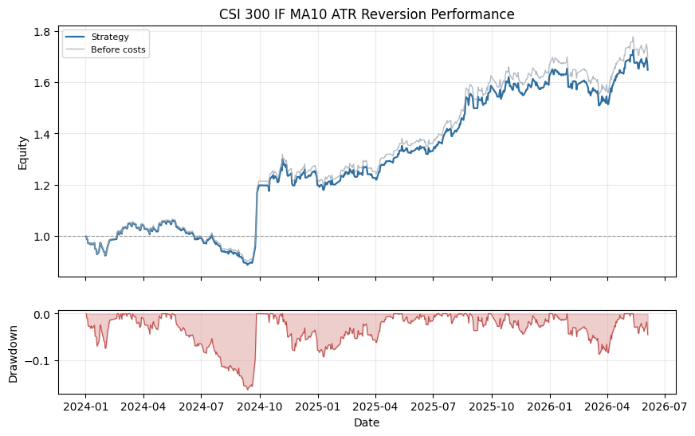

# CSI 300 IF MA10 ATR Reversion

## Summary

- Domain: `time_series`
- Type: Rule-based futures
- Label: none

A single-instrument time-series rule example that holds CFFEX CSI 300 index futures when price is below its 10-day moving average, with an ATR trailing stop controlling exits.

## Performance Chart

## Metrics

| Metric | Value |
|---|---:|
| `2024_return` | 0.1980 |
| `2025_return` | 0.3542 |
| `2026_return` | 0.0156 |
| `active_day_ratio` | 0.1336 |
| `ann_return` | 0.2289 |
| `ann_volatility` | 0.1675 |
| `avg_daily_turnover` | 0.1336 |
| `calmar_ratio` | 1.4040 |
| `max_drawdown` | 0.1631 |
| `month_num` | 29.0688 |
| `sharpe_ratio` | 1.3671 |
| `sortino_ratio` | 2.8712 |
| `total_return` | 0.6477 |
| `total_transaction_cost` | 0.0312 |
| `trade_days` | 78.0000 |

## Notes

- Uses PandaData CFFEX.IF99 dominant CSI 300 index futures daily bars stored under data/market/1d/.
- Report window starts on 2024-01-01, matching the local IF parameter sweep window.
- Entry rule: hold IF when close is below MA10.
- Exit rule: leave the position when close falls below the highest price since entry minus 2.0 times ATR(14).
- Weights are run through the shared vectorized VectorBacktester with zero signal lag and forward close-to-close returns.
- Transaction cost assumptions are commission 2bp plus slippage 2bp.

## Recent Result Rows

| Date | return | raw_return | cum_return | drawdown | turnover |
|---|---:|---:|---:|---:|---:|
| 2026-05-29 | -0.0076 | -0.0076 | 0.6595 | -0.0380 | 0.0000 |
| 2026-06-01 | 0.0141 | 0.0141 | 0.6828 | -0.0245 | 0.0000 |
| 2026-06-02 | 0.0072 | 0.0072 | 0.6949 | -0.0175 | 0.0000 |
| 2026-06-03 | -0.0087 | -0.0087 | 0.6801 | -0.0260 | 0.0000 |
| 2026-06-04 | -0.0193 | -0.0193 | 0.6477 | -0.0449 | 0.0000 |
