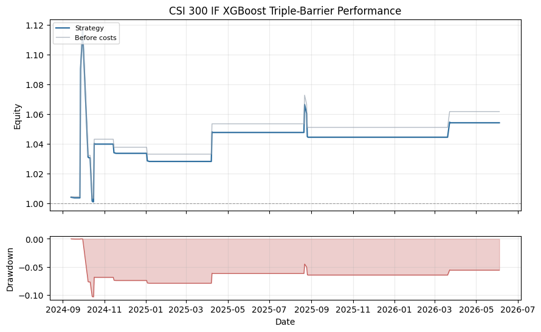

# CSI 300 IF XGBoost Triple-Barrier

## Summary

- Domain: `time_series`
- Type: XGBoost futures
- Label: triple-barrier

A real-data time-series ML example. XGBoost classifies triple-barrier states from log-difference and price/volume features on CFFEX.IF99, then takes long or short IF exposure when the corresponding barrier probability is high.

## Performance Chart

## Metrics

| Metric | Value |
|---|---:|
| `2024_return` | 0.0335 |
| `2025_return` | 0.0105 |
| `2026_return` | 0.0093 |
| `active_day_ratio` | 0.0436 |
| `ann_return` | 0.0310 |
| `ann_volatility` | 0.1006 |
| `avg_daily_turnover` | 0.0436 |
| `calmar_ratio` | 0.2990 |
| `max_drawdown` | 0.1037 |
| `month_num` | 20.7000 |
| `sharpe_ratio` | 0.3083 |
| `sortino_ratio` | 0.4877 |
| `total_return` | 0.0541 |
| `total_transaction_cost` | 0.0072 |
| `trade_days` | 18.0000 |

## Notes

- Label is generated by TripleBarrierLabelMaker with L=3, pt_sl=0.8, t_limit=2.
- Model is XGBoost multi-class classification with strategy-domain log-difference features plus public price/volume factors.
- Training uses rows before 2024-01-01; reports show the held-out period.
- Signal is the predicted positive-minus-negative barrier probability spread; absolute spread above 0.10 opens a position.
- Weights are run through the shared vectorized VectorBacktester with zero signal lag and forward close-to-close returns.

## Recent Result Rows

| Date | return | raw_return | cum_return | drawdown | turnover |
|---|---:|---:|---:|---:|---:|
| 2026-05-29 | 0.0000 | 0.0000 | 0.0541 | -0.0561 | 0.0000 |
| 2026-06-01 | 0.0000 | 0.0000 | 0.0541 | -0.0561 | 0.0000 |
| 2026-06-02 | 0.0000 | 0.0000 | 0.0541 | -0.0561 | 0.0000 |
| 2026-06-03 | 0.0000 | 0.0000 | 0.0541 | -0.0561 | 0.0000 |
| 2026-06-04 | 0.0000 | 0.0000 | 0.0541 | -0.0561 | 0.0000 |
