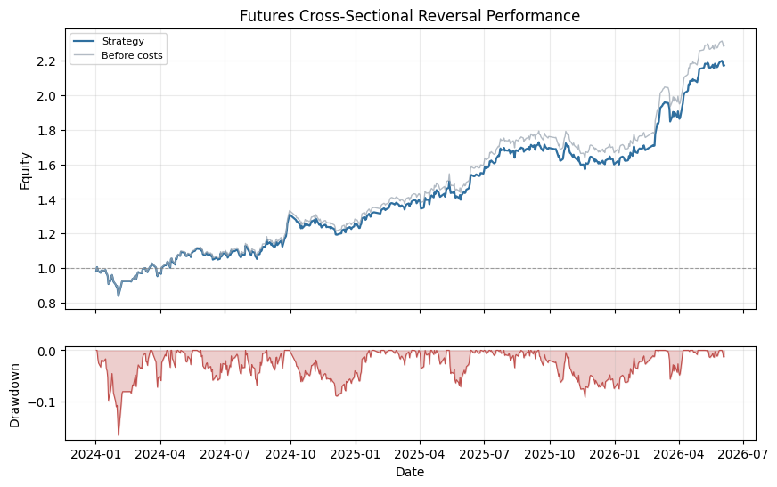

# Futures Cross-Sectional Reversal

## Summary

- Domain: `cross_sectional`
- Type: Rule-based futures
- Label: none

A non-precious futures rotation example. It ranks stock-index, industrial, agricultural, and energy futures by 120-day moving-average gap reversal strength, then holds the two most stretched contracts with risk-parity weights.

## Performance Chart

## Metrics

| Metric | Value |
|---|---:|
| `2024_return` | 0.2578 |
| `2025_return` | 0.2717 |
| `2026_return` | 0.3580 |
| `active_day_ratio` | 0.3322 |
| `ann_return` | 0.3774 |
| `ann_volatility` | 0.1913 |
| `avg_daily_turnover` | 0.2171 |
| `calmar_ratio` | 2.2747 |
| `gold_return_corr` | 0.0419 |
| `max_drawdown` | 0.1659 |
| `month_num` | 29.0688 |
| `sharpe_ratio` | 1.9735 |
| `sortino_ratio` | 3.7372 |
| `total_return` | 1.1722 |
| `total_transaction_cost` | 0.0507 |
| `trade_days` | 194.0000 |

## Notes

- Uses PandaData dominant futures daily bars stored under data/market/1d/.
- Precious metals are excluded from the tradable universe so the result is not a disguised gold trend.
- Signal is the negative distance from the 120-day moving average; larger values are more mean-reversion stretched.
- The top two contracts are rebalanced every three trading days with 60-day risk-parity weights.
- Weights are run through the shared vectorized VectorBacktester with zero signal lag and forward close-to-close returns.
- Transaction cost assumptions are commission 2bp plus slippage 2bp.

## Recent Result Rows

| Date | return | raw_return | cum_return | drawdown | turnover |
|---|---:|---:|---:|---:|---:|
| 2026-05-29 | 0.0028 | 0.0028 | 1.1923 | 0.0000 | 0.0000 |
| 2026-06-01 | 0.0031 | 0.0031 | 1.1990 | 0.0000 | 0.0000 |
| 2026-06-02 | -0.0051 | -0.0051 | 1.1877 | -0.0051 | 0.0029 |
| 2026-06-03 | -0.0081 | -0.0081 | 1.1701 | -0.0132 | 0.0000 |
| 2026-06-04 | 0.0010 | 0.0010 | 1.1722 | -0.0122 | 0.0000 |
