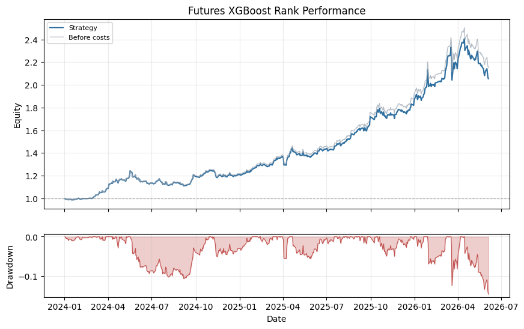

# Futures XGBoost Rank

## Summary

- Domain: `cross_sectional`
- Type: XGBoost futures
- Label: rank label

A real-data cross-sectional ML example. XGBoost predicts each future's forward-return rank label and allocates to the top two predicted ranks with risk-parity weights.

## Performance Chart

## Metrics

| Metric | Value |
|---|---:|
| `2024_return` | 0.2089 |
| `2025_return` | 0.5439 |
| `2026_return` | 0.1005 |
| `active_day_ratio` | 1.0000 |
| `ann_return` | 0.3460 |
| `ann_volatility` | 0.1743 |
| `avg_daily_turnover` | 0.1986 |
| `calmar_ratio` | 2.3685 |
| `max_drawdown` | 0.1461 |
| `month_num` | 29.0688 |
| `sharpe_ratio` | 1.9847 |
| `sortino_ratio` | 3.0541 |
| `total_return` | 1.0539 |
| `total_transaction_cost` | 0.0464 |
| `trade_days` | 584.0000 |

## Notes

- Label is the percentile rank of 60-day forward return within the real futures universe.
- Features are generic public momentum, volatility, trend, and mean-reversion factors.
- Training uses rows before 2024-01-01; reports show the held-out period.
- Weights are run through the shared vectorized VectorBacktester with zero signal lag and forward close-to-close returns.

## Recent Result Rows

| Date | return | raw_return | cum_return | drawdown | turnover |
|---|---:|---:|---:|---:|---:|
| 2026-05-29 | 0.0074 | 0.0074 | 1.1194 | -0.1189 | 0.0084 |
| 2026-06-01 | 0.0109 | 0.0115 | 1.1426 | -0.1092 | 1.3329 |
| 2026-06-02 | -0.0183 | -0.0183 | 1.1033 | -0.1255 | 0.0046 |
| 2026-06-03 | -0.0166 | -0.0161 | 1.0684 | -0.1401 | 1.3376 |
| 2026-06-04 | -0.0070 | -0.0065 | 1.0539 | -0.1461 | 1.3385 |
