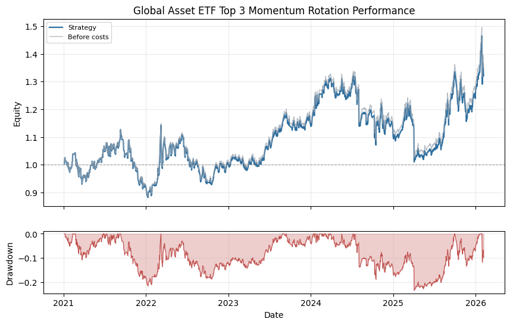

# Global Asset ETF Top 3 Momentum Rotation

## Summary

- Domain: `cross_sectional`
- Type: Rule-based listed-fund rotation
- Label: 20/60/120-day composite momentum

A public large-asset rotation example across 18 listed ETF/LOF proxies. It ranks China and global equity indices, government bonds, gold, crude oil, soybean meal, nonferrous metals, and broad commodities, then holds the strongest Top 3 at equal weights.

## Performance Chart

## Metrics

| Metric | Value |
|---|---:|
| `2021_return` | -0.0789 |
| `2022_return` | 0.0915 |
| `2023_return` | 0.1449 |
| `2024_return` | -0.0426 |
| `2025_return` | 0.1482 |
| `2026_return` | 0.0438 |
| `active_day_ratio` | 0.0413 |
| `ann_return` | 0.0562 |
| `ann_volatility` | 0.1985 |
| `avg_daily_turnover` | 0.0421 |
| `calmar_ratio` | 0.2390 |
| `max_drawdown` | 0.2352 |
| `month_num` | 61.0495 |
| `sharpe_ratio` | 0.2832 |
| `sortino_ratio` | 0.4371 |
| `top_n` | 3.0000 |
| `total_return` | 0.3208 |
| `total_transaction_cost` | 0.0208 |
| `trade_days` | 51.0000 |
| `universe_size` | 18.0000 |

## Notes

- The explicit public universe is defined by `strategies.cross_sectional.asset_class_rotation.ASSET_CLASS_ETF_UNIVERSE`.
- Score is the equal-weight average of trailing 20-day, 60-day, and 120-day returns.
- The portfolio rebalances every 20 trading days into the Top 3 assets at equal target weights.
- A later-listed or later-imported proxy becomes eligible only after it has enough local history for all lookbacks.
- The report ends on 2026-02-06, the latest observation shared by all configured proxies.
- Raw-price share splits are forward-adjusted for SHSE.513100 (1:5), SHSE.513500 (1:2), and SHSE.510170 (1:4) before signals and returns are computed.
- SHSE.501018 and SZSE.164824 are exchange-listed LOF proxies for crude oil and Indian equities, not ETFs.
- SHSE.510170 is a broad-commodity producer-equity ETF, not a commodity-futures basket.
- Weights are run through the shared VectorBacktester with zero signal lag and forward close-to-close returns.
- Transaction cost assumptions are commission 2bp plus slippage 2bp.

## Recent Result Rows

| Date | return | raw_return | cum_return | drawdown | turnover |
|---|---:|---:|---:|---:|---:|
| 2026-01-30 | -0.0766 | -0.0766 | 0.2906 | -0.1187 | 0.0000 |
| 2026-02-02 | 0.0406 | 0.0406 | 0.3430 | -0.0829 | 0.0000 |
| 2026-02-03 | 0.0173 | 0.0173 | 0.3663 | -0.0670 | 0.0000 |
| 2026-02-04 | -0.0277 | -0.0277 | 0.3285 | -0.0928 | 0.0000 |
| 2026-02-05 | -0.0058 | -0.0058 | 0.3208 | -0.0981 | 0.0000 |
